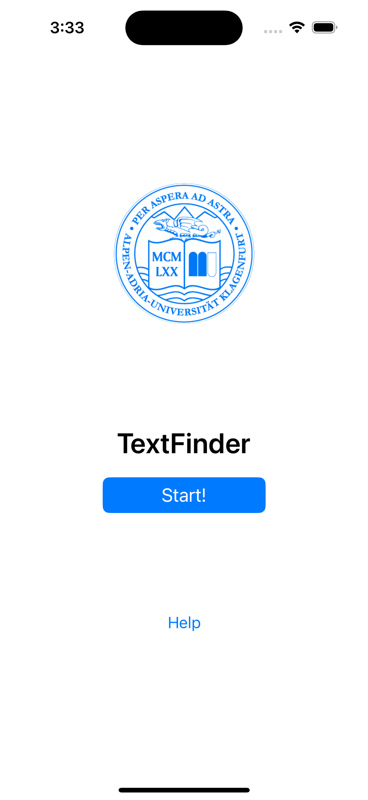
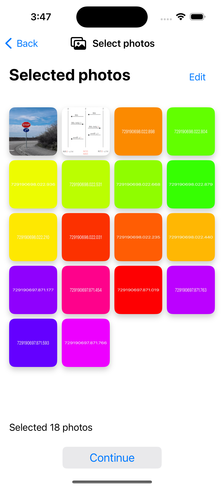
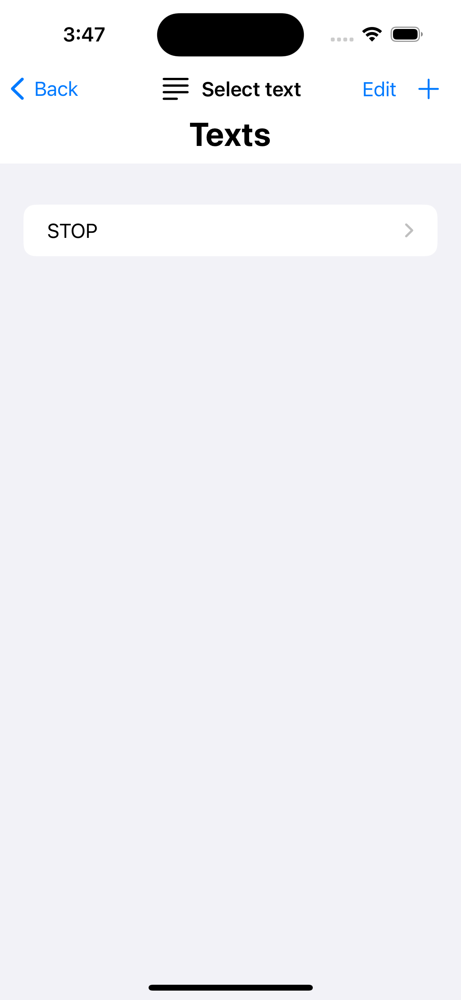

### 📱 TextFinder

#### Purpose
The primary objective of this application is to provide users with the capability to search for specific text within a collection of images 🖼️. 
Users can select the text they wish to search for and then choose a group of images from which they want to find the text. This functionality enables users to efficiently locate and extract relevant information from a variety of visual content, enhancing their productivity and facilitating tasks such as information retrieval, data analysis, and document organization 🕵️‍♂️.

#### Screenshots
**HomeView**: The starting point of the application, containing a "Help" button and a "Start" button.
|  |
|:--:|
| <b>Initial screen </b>|

**PhotosDisplayView**: Responsible for displaying and managing selected photos within a grid view.
|  |
|:--:|
| <b>Photos selection </b>|

**TextDisplayView**: Displays the list of texts created by the user that must be searched within the images.
|  |
|:--:|
| <b>Text selection </b>|

**ProcessView**: Core of the application, responsible for searching for text within the selected images using CNN.
|  |
|:--:|
| <b>Found text </b>|
